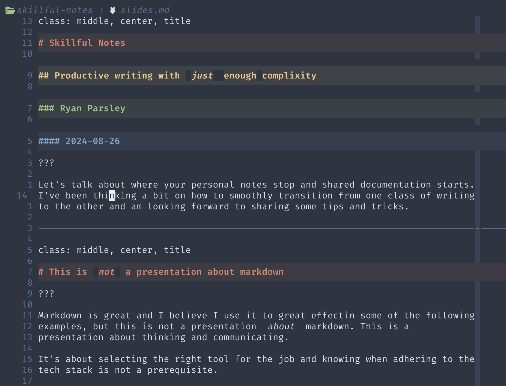
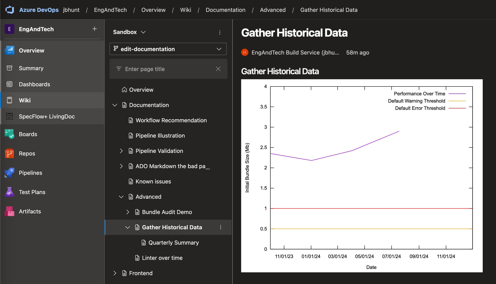
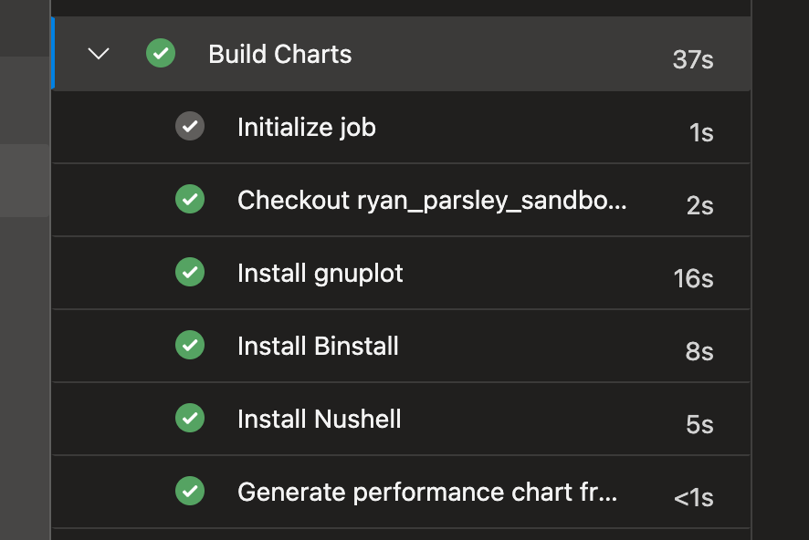
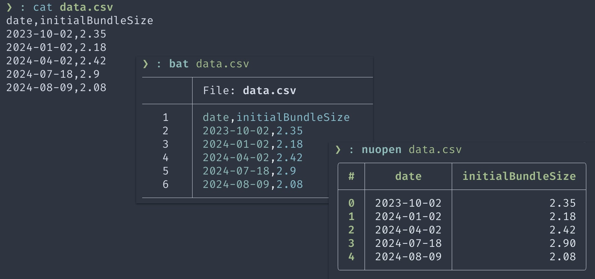
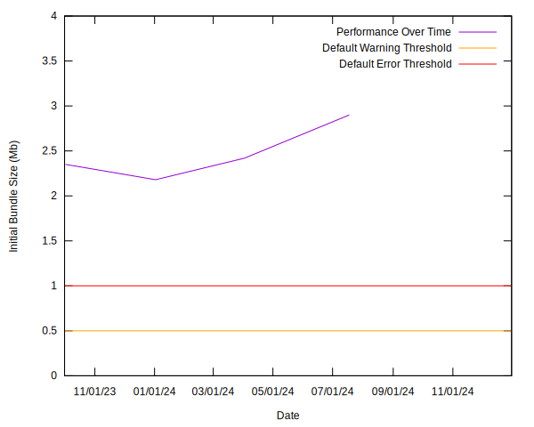
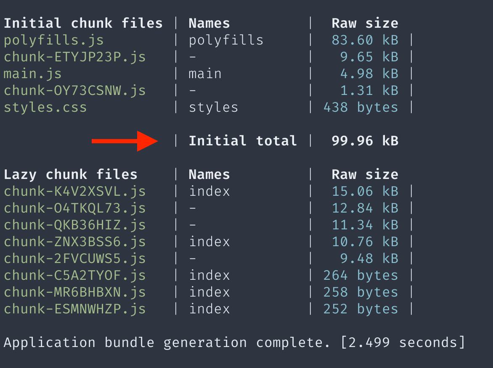
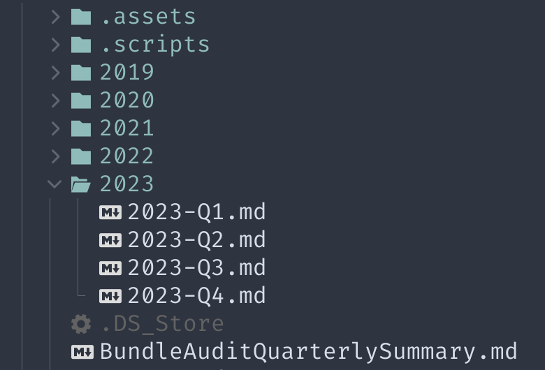
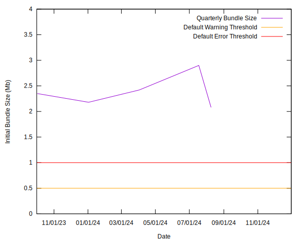
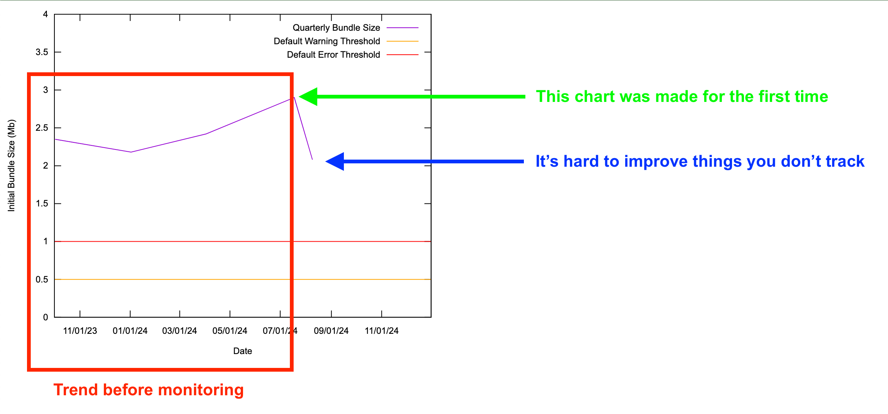

<!--
_class: lead
-->

# Skillful Notes

## Productive writing with _just_&nbsp;enough&nbsp;complexity

### Ryan Parsley

#### 2024-08-26

<!--

Sometimes I write to help other people figure stuff out.
This takes the form of documentation or wiki posts.

Sometimes, I'm writing so I can figure something out.

My notes, or PKM, if you're fancy like Craig

-->

---

<!--
_class: lead
-->

> Writing is a concentrated form of thinking.
> ...to define things, define muddled experience in economical ways
>
> &mdash;Don DeLillo

<!--

For those of you that don't work closely with me, I tend to post notes eagerly.

Meaning, I share ideas that I'm still figuring out.

Shoot, I'm actively wresting with 1/3 of the content in this presentation!

Learning in public like this has been very effective for me, but this isn't a
presentation to convince you about that.

Whatever cadence you _release_ you words into the world, I believe there's value
in making this publish workflow seamless.

That's why I write my notes, documentation, presentations and well pretty much
everything in markdown using vim. Vim may not be your flavor of frictionless.
That's fine. Use whatever editor works for you.

Keep writing and publishing as frictionless as possible or you simply won't do.
-->

---

<!--
_class: lead
-->

# This is _not_ a presentation about markdown

(Thanks for the slide Craig)

<!--

Markdown is great and I believe I use it effectively in the following examples,
but this is **not** a presentation _about_ markdown. That's simply an
implementation detail.

This presentation is about **crafting a narrative**.

This presentation is about communicating efficiently.

Using data to help you tell your story and using code to help you present and
best leverage that data.

So, this is a presentation about using code to tell a story.

Sometimes, the words you write can be more impactful with data to back you up.
Maybe a table of figures will suffice, maybe you _want_ a chart. But you *need*
data to tell the story.

Sometimes, you start with a heap of data and you want to help tell it's story.
You should hang back on the writing while you aggregate some data.
Then, mine a narrative from that. You may know there's a story to tell, but don't
know what it is until after you've

Don't reach for a spreadsheet!

Do not open another browser tab.

Reach for your text editor!

We are developers. We are web developers!

-->

---

# A brief history of Markdown

> Markdown’s syntax is intended for one purpose: to be used as a format for
> writing for the web.
>
> &mdash;John Gruber

<!--

And that is probably at the heart of why markdown speaks to me. It is of the
internet.

John Gruber made an ergonomic dialect to speed up the writing process for his
static site blog.

If you don't like markdown, file an issue with github. It's the defacto
standard for documentation so best get comfortable with it.

If it's the lingua franca of github, ADO, and any static site generator you care
to use.

If you're not a developer and markdown feels complicated, know that this wasn't
invented by a developer. It was invented by a writer who was looking for
efficiency.

Bouncing from gui to gui learning differences between similar but not compatible
interfaces eats time and energy.

Sometimes richness brings affordances, it always brings complexity.

-->

---

# Does `X` _support_ markdown?

> A Markdown-formatted document should be publishable as-is, as plain text,
> without looking like it’s been marked up with tags or formatting instructions.
>
> &mdash;John Gruber

<!--

Even if the answer is no, the experience is pretty good.

That is the killer feature of markdown.

Depending on how you look at it we're talking graceful degradation or
progressive enhancement here.

Even in the complete absence of "support" you can still read it just fine. I can
write markdown on a piece of paper with a pen and you can pick up what I'm
putting down.

-->

---

<!--
_class: lead
-->

# Extensions, that's where they get you

<!--

Gruber had, by design, a very spartan list of tags. As primarily a writer he
designed an API of sorts that was primarily optimized for writing.

It's not his fault developers got a little "too" into the idea.

Commonmark is the gold standard and GFM is nigh indistinguishable from it. Any
parser or renderer worth it's salt will support both so you don't need to work
about compatibility like the olden times.

I don't want to get into the weeds on parsers. Whatever language or context
you're working with markdown, check for commonmark support and you're mostly
good to go.

## Who's feature is this anyway?

I like about mermaid syntax, I can type it in ado, I can type it in vim, I can
render it in mdbook... it's not tightly coupled to any one environment or
context.

It's worth becoming familiar with the common denominator of various parsers so
you can be aware of what's likely to not work when you port your data from one
platform to another.

Every parsing option has a different means of extending commonmark. That is very
powerful, but also the point at which you are compromising on portability. This
compromise is sometimes reasonable and worth it. Just be aware of it.

-->

---

<!--
_class: lead
-->

# This is _not_ a presentation about Obsidian

<!--

Let's talk a little about tools.

This is also not a presentation about obsidian.

I'm not anti-obsidian.

I don't use it for work anymore but I still keep my personal notes on it.

Obsidian is a wonderful lens to observe writing through.

The obsidian community has put out a ton of great content that's helped me focus
my own thoughts on note taking.

PKM, zettlekasten, second brain are all concepts that I learned through an
obsidian lens. But you don't _need_ obsidian for any of that.

-->

---

# Obsidian Community

> I would look for obsidian plugins that are along that path, and then work
> backwards into what they are using.
>
> &mdash;Craig

<!--

Craig pretends like he's not collaborating on this presentation, but I know the
reason there's only one set of footprints.

There is wisdom in this community that transcends Obsidian. It just happens
to be expressed in Obsidian. Don't get hung up on that implementation detail.

Not only is the Obsidian community big and verbose, they're very thoughtful.
Content creators that talk about Obsidian get deep in the weeds.

Obsidian community is a group of people that express themselves through
interpretive plain text.

-->

---

# When Obsidian starts feeling wrong to me

````markdown
```dataview
TABLE author, published, file.inlinks AS "Mentions"
FROM #poems
```
````

<!--

Dataview is one of my favorite parts of Obsidian and also a bit of a smell with
respect to the litmus test of "Does publishing this read well unrendered?"

It's easy to reason about what that does, but it means nothing outside of
obsidian.

I am uneasy making the compromise that this extension demands.

As this only adds value in the context of obsidian and no extensions exist in
any other context, this is not "future proof". This is not a transferable skill
unless you are willing to write an implementation to take with you. This could
be reasonable, but that's beyond the scope of this presentation (maybe next
quarter).

-->

---

# What's the killer feature of any decent editor/ IDE?



<!--

I hope among the top 5 are... ergonomics and extensibility!

What skills do you want to get good at?

There's no guarantee that you'll get good at things you practice.

Things you practice are the only things you can improve at.

I don't aspire to be an expert excel technician. I don't want to be a **power

You only get better at what you practice.

Why would a dev _not_ want to trick out their editor instead of using Obsidian?
-->

---

# LSP

## Language Server Protocol

### Examples

- Markdown Oxide
- Marksman

### Features

- follow links
- count references
- complain about dead links

<!--

LSPs are what fuel your editor's syntax highlighting and code suggestions.

And they can turbo charge your markdown experience much the same way.
-->

---

# Documentation as code

## Stuff you may commit via pipelines

- Changelogs
- Install Checklist
- Betterer

## Pipeline side effects hither and yon

- Performance Audit
- Unit Test Coverage
- Cypress Results

<!--

Did you know you can click around in ADO to define folder in your monorepo as
the source of your wiki?

Just because some people read wikis in the browser doesn't mean you should edit
them there.

If you're using the same tool to write your docs and your code...

Why not put your docs in the same place as your code?

It opens you up to a whole world of possibilities.

The build pipeline is all about generating artifacts.

It does get a little tricky conceptually to commit to the codebase, but we
already do that in some instances too.

You are a developer!

You don't need to be beholden to what some tool makes. You can craft custom
solutions.

You are a developer even when you're doing other things.
-->

---

<!--
_class: lead
-->

# But, ADO can't parse that

<!--

Ok, let's assume I've won you over that we want rich documentation built on
markdown in our monorepo.

I can hear you saying: "Yeah, but you said ADO doesn't do cool things"
-->

---

# Doesn't matter



<!--
Rendering SVG is cool and it does that.

SO, you _just_ need to sort out a way to render assets in the pipeline.

BYO parsing if you care to
-->

---

<!--
_class: lead
-->

# Sounds slow

---

# It's not



---

<!--
_class: lead
-->

# But Ryan, I don't like editing tables in markdown

---

<!--
_class: lead
-->

# Yeah, me neither. Don't do that

<!--

If I'm editing a lot of data manually for some reason, I'm probably tucking that
in frontmatter.

The occasional trivial table is fine like half a dozen columns
or less and not many more rows. Think less excel alternative and more, neatly
arrange features and benefits. Just because you write text in markdown doesn't
mean you _need_ every aspect of your docs to be constrained to markdown syntax.

You can _just_ consume data from a CSV or whatever works for you.

When you make a website, you write html, but include images, audio, whatever you
need.

Markdown is just html without the stabby brackets.
-->

---

# What if, you dynamically update static markdown!?

```markdown
## Table of MacGuffin

<!-- START GENERATED CONTENT -->

| key  | value |
| ---- | ----- |
| foo  | bar   |
| baz  | qux   |
| quux | corge |

<!-- END GENERATED CONTENT -->

<!--
Warning: The above text is generated via scripts from `.assets/_table.md`
Don't update it manually. Instead run the update script.
-->
```

<!--
I could be happy in a code base that normalized comments like this.

How different is that ergonomically from a code block.

It doesn't take a lot of imagination to see a dataview shaped solution that
yields human readable source code.

This gets dangerously close to literate code and if you're curious about that,
let me know because I maybe wouldn't mind a 13th week being a good excuse to
plunge into that topic.

Documentation full of code that is runnable to, in turn, render portions of
documentation. A beautiful synergistic fractal of expressiveness.

-->

---

# Just about everything makes JSON

- Unit Tests
- Linters
- Angular CLI

<!--

Think about the amazing things you can do with json. This is your super power!
Don't overlook it _just_ because this json happens to be a static asset.

-->

---

# Don't sleep on CSVs



<!--

They're easy to create and reason about. One can open them as a spreadsheet and
you can parse them into whatever asset makes sense to best tell their story.
-->

---

# Gnuplot

```gnuplot

set terminal svg enhanced background rgb 'white';
set output 'assets/performance-summary.svg';
plot 'assets/performance-summary.txt' with lines
  title 'Match Performance Over Time';

```

<!--

Gnuplot has been actively developed since 1986.

It had a major release this year!

So don't dismiss it as a 40 year old software :D

I can't predict the future but 40 years of active development gives me warm
fuzzy feelings about this tool.

-->

---

# Gnuplot (less trivial)

```gnuplot
set xdata time;
set ylabel 'Initial Bundle Size (Mb)';
set xlabel 'Date';
set timefmt '%Y-%m-%d';
set xrange ['2023-10-01':'2024-12-31'];
set yrange [0:4];
set terminal svg enhanced background rgb 'white';
set datafile separator ",";
set output '../.assets/performance-summary.svg';
warning(x) = .5;
error(x) = 1;
plot
    '../.assets/data.csv' using 1:2 with lines title 'Hello World',
    warning(x) title 'Default Warning Threshold' lt rgb 'orange',
    error(x) title 'Default Error Threshold' lt rgb 'red';
```

---

# Gnuplot (output)



<!--

Gnuplot runs in a pipeline, meaning you can generate a CSV and render a chart
from that and embed it in your wiki. ADO Markdown doesn't _need_ to support
javascript or some bespoke plugin. It supports linking up images.

-->

---

# Streetlight effect

> a type of observational bias that occurs when people only search for something
> where it is easiest to look.

<!--

Sometimes, the things that are easy to track are not what you need.

Apdex is very inactionable. It's way to abstract. It may tell you that you have
a problem but completely hides what that problem is from you.

Bundle size directly impacts your performances. We don't monitor that over time.

I assert that making it easy to monitor that will make it more

Aggregate data is problematic with respect to Action Items.
-->

---

# Bundle Audit Sidebar

| Bundle Size (MB) | Time to Interactive (s) | Speed Index (s) |
| ---------------- | ----------------------- | --------------- |
| 0.365            | 0.7                     | 0.8             |
| 1.36             | 0.9                     | 1.3             |
| 2.36             | 1.3                     | 1.7             |
| 3.36             | 4.1                     | 2.1             |
| 4.36             | 4.9                     | 2.45            |
| 5.36             | 5.8                     | 2.9             |

<!--
Apdex is high level to a fault. If you want to impact performance you need to
get intimately familiar with the things you can change.

That table is straight out of a wiki post linked in the end and I don't want to
get lost in the weeds, but do want to level-set on the importance of bundle size.

Bundle size is one of my favorite performance targets because it's a legitimate
problem in most apps and it happens to be easy to monitor. Roughly every
megabyte costs a second to your Time to Interactive.
-->

---

# Bundle Audits from Notes

## 

<!--
This data exists and it's visible every time you run a build, but it's way more
valuable as something tracked over time. So, I threw that string in a markdown
file once a quarter and came back to it periodically.
-->

---

# Bundle Audits from Notes

## Folder stucture



<!--

Capture data the simplest way you can.

Avoid friction!

Nothing too fancy, every couple of months I'd periodically make notes on the
build.
-->

---

# Bundle Audits from Notes

## A given note

```bash
---
buildTag: 3.55.0
commit: 8b3280
bundleSize: 1.88
---

# 2023 Q4

Write some notes about what was going on at the time, maybe.
```

<!--

This is a common enough approach with obsidian and I had a plugin that would
enable a higher order note to render a chart based on the bundleSize
frontmatter.

This was powerful. It helped me understand and craft a narrative of progress
over time that was not supported by how we operate ADO.

Simple ideas like this can have a profound impact on how you see opportunities
and challenges.
-->

---

# Bundle Audits from Notes

## Script to scrape frontmatter

```nu
['2019', '2020', '2021', '2022', '2023']
  | each {|| ls $in}
  | flatten
  | where $it.name != matchPerformanceQuarterly.md
  | each {
      |file| $"(open $file.name)"
        | find "bundleSize"
        | first
        | split column ":" key value
        | get value
    }
  | flatten
  | save $output -f
```

<!--

Originally, I did what I did how I did it because that's a common approach in
Obsidian.

Then, I wrote this script so obsidian wasn't a dependency.

I used NuShell. Hopefully you caught Bradley's presentation earlier, if not,
check out the recording to hear more about this language. I use it locally and
it's used in support of at least 3 app's pipelines at this time.
-->

---

<!--
_class: lead
-->

# Dude, I don't care to maintain&nbsp;a&nbsp;journal

<!--

# But that doesn't scale!

That previous example was the right approach for me at the time given the
context. Now, I'm trying to share the benefits of watching that with apps I'm
not regularly involved in. Time to take what I learned about the data and
promote it to pipeline tasks

-->

---

# Bundle Audits via pipeline

## Calculate bundle size

```nu
def calculateInitialBundleSize [] {
  open dist/stats.json
    | get assets
    | where {
        | asset | $asset.name in [
          'main.js',
          'polyfills.js',
          'my-styles.css',
          'styles.css',
          'foundationBase.css',
          'runtime.js',
          'scripts.js'
        ]
      }
    | get size
    | math sum
}
```

<!--

To me, this feels slick. You're using the angular CLI to generate a source of
truth, but exposing the data via a focused lens.

-->

---

# Bundle Audits via pipeline

## Gather context from git

```nu
def getLastCommitDetails [] {
  git log --pretty=%h»¦«%s»¦«%aN»¦«%aE»¦«%aD
  | lines
  | split column "»¦«" commit subject name email date
  | first 1
  | insert initialBundleSize (calculateInitialBundleSize)
}
```

<!--

But, even better... you can combine data in any way that helps you craft a
narrative. People say "the data can't lie".

A lot of times, it mumbles.

Help it articulate.
-->

---

# Bundle Audits via pipeline

## Save it to a CSV

```nu
def main [] {
  open bundleLog.csv
  | append (getLastCommitDetails)
  | collect
  | save bundleLog.csv --force
}
```

<!--

I assert that even if you've never seen nushell before this presentation, you
can pick up what's going on in this slide.

Even at this level, the code is telling you it's own story.

-->

---

# Remember this?


<!--

This chart made an apearence earlier in the presentation. It was generated by
Gnuplot.

-->

---

# There's an update



<!--
What! They trimmed nearly 1MB off that initial bundle!

800kb is more accurate.

That shows the app's bundle size at an all time low for the year, now.

Notice how this story is way more intersting with all this data?

You was falling asleep with me droning on about semantic web yada yada

Then you see that chart dip drastically and you're sitting on the edge of your
seat reaching for a pen.

-->

---

# What changed?



<!--
So what happened?

The upward drift was a secret problem. The technique illustrated in this
presentation exposed the issue. I brought it to Anthony's attention, he
corrected a years worth of slippage faster than you can say "apdex".

-->

---

<!--
_class: lead
-->

# This is _not_ a presentation about bundle audits

<!--

I hope seeing some of what I've been noodling with inspires you to solve your
own problems in delightful ways. If so please share me the weird and creative
code you write.

-->

---

# References

## Tools I use

- [Zellij (multiplexor)](https://zellij.dev/)
- [Stow (helps manage dot files)](https://www.gnu.org/software/stow/manual/stow.html)
- [mise (polyglot version manager)](https://mise.jdx.dev/getting-started.html)
- [WezTerm (terminal emulator)](https://wezfurlong.org/wezterm/index.html)
- [Neovim (editor)](https://neovim.io/)
- [~~Remark~~](https://github.com/remarkjs/remark) [Marp (markdown powered slides)](https://marp.app/)
- [Nushell (alternative shell)](https://www.nushell.sh/)

---

# See Also

- [GFM Docs](https://github.github.com/gfm/)
- [Streetlight Effect](https://en.wikipedia.org/wiki/Streetlight_effect)
