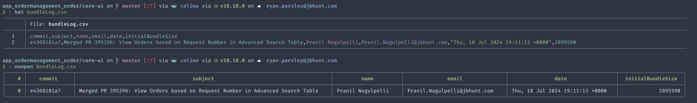

<!--
_class: lead
-->

# Skillful Notes

## Productive writing with _just_&nbsp;enough&nbsp;complixity

### Ryan Parsley

#### 2024-08-26

<!--

Let's talk about where your personal notes stop and shared documentation starts.
I've been thinking a bit on how to smoothly transition from one class of writing
to the other and am looking forward to sharing some tips and tricks.

-->

---

<!--
_class: lead
-->

# This is _not_ a presentation about markdown

(Thanks for the slide Craig)

<!--

The next couple of slides are going to discuss markdown past and present, but
this presentation is about crafting a narritive with data. Help your data tell a
story or better tell a story with data.

Markdown is great and I believe I use it to great effect in some of the following
examples, but this is not a presentation _about_ markdown. This is a
presentation about thinking and communicating.

It's about selecting the right tool for the job and knowing when adhering to the
tech stack is not a prerequisite.

-->

---

# A brief history of Markdown

> Markdown’s syntax is intended for one purpose: to be used as a format for
> writing for the web.
>
> &mdash;John Gruber

<!--

John Gruber made an ergonomic dialect to speed up the writing process for his
static site blog.

It's not his fault developers got a little "too" into the idea.

-->

---

# Does `X` _support_ markdown?

> A Markdown-formatted document should be publishable as-is, as plain text,
> without looking like it’s been marked up with tags or formatting instructions.
>
> &mdash;John Gruber

<!--
Yes, that's the beauty of markdown. Even in the complete absence of "support"
you can still read it just fine. I can write markdown on a piece of paper with a
pen and you can pick up what I'm putting down.

Lack of rich text support in early iPhone created a hole that markdown filled.

Once it was a popular enough defacto standard, devs made support for it better
and better.

Depending on how you look at it we're talking graceful degradation or
progressive enhancement here.

As you venture into advanced markdown territory, focus on that objective. That's
a pretty good north star.

Don't sweat this detail too much. Your data is safe, you may just not have the
preferred experience in every context.
-->

---

# Standards


<!--

Markdown gets a bad rap with respect to compatibility because of 2 issues.

1. Historically, predicting support was tricky
2. People's expectations are poorly calibrated

Gruber had by design a very spartan list of tags. He was a writer and designed
and API of sorts optimized for writing.

# Commonmark

This is a reasonable place to start if you want to consider a superset of what
Gruber set out to achieve.

# GFM

Strict superset of common mark now, but really, I'd just stick to Common mark
and extend it via your parser's ecosystem

# ADO

ADO does _not_ support common mark. It claims to support GFM, but seems like it
more accurately reserves the right to support a subset of GFM while also doing
it's own thing. That's fine. Stick to the gruber stuff and you'll have a good
time.

-->

---

<!--
_class: lead
-->

# Extensions, that's where they get you

<!--

Know that there are various standards and degrees of not following said
standards. I don't want to get into the weeds on parsers. Whatever language or
context you're working with markdown, check for commonmark support and you're
mostly good to go.

It's worth becoming familiar with the common denominator of various
parsers so you can be aware of what's likely to not work when you port your data
from one platform to another.

Every parsing option has a different means of extending commonmark. That is very
powerful, but also the point at which you are compromising on portability. This
compromise is sometimes reasonable and worth it. Just be aware of it.

-->

---

# Markdown TLDR

- Most parsers don't mess up what gruber defined
- If you're picking a tool, confirm they support CommonMark
- you can extend CommonMark, through plugins based on the parser you select
- Compatibility is largely solved by 2024

---

<!--
_class: lead
-->

# This is _not_ a presentation about markdown

<!--
This is a presentation about crafting a narritive.

This is _about_ telling a story.

Markdown is a reasonable tool, nothing more.

I said all that because I continue to use markdown as my writing standard of
choice. There are others. I've considered org mode an neorg but I like the
ubiquity of markdown and gruber's subset is what I use the vast majority of
writing. My whole career, I've been making websites, a big chunk of that was
customizing content management systems.
-->

---

<!--
_class: lead
-->

> It defines the meaning and structure of web content.
>
> &mdash;[MDN (regarding HTML)](https://developer.mozilla.org/en-US/docs/Web/HTML)

---

# Form and purpose


<!--

A lot of times a GUI can hide or diminish the structure bit by focusing your
attention on styling as sort of an arbitrary choice.

I made it green, why? I was feeling sassy

Why is this text a little smaller than that text? oh, to make it fit on the
slide.

bonkers, I have no patience for this

if your markdown is a wall of similar formatted text, that is a sign you've not
structured it.

if it looks like a ransom note, it is a sign that you've poorly structured it.

As you apply structure to your notes... you'll be encouraged to structure your
thoughts.
-->

---

# What's the killer feature of Obsidian?

## First place

### The community

## Tied for second

### Ergonomics and Extensibility

<!--

Let's talk a little about tools.

This is also not a presentation about obsidian.

I'm not anti-obsidian.

I don't use it for work anymore but I still keep my personal notes on it.

The obsidian community has put out a ton of great content that's helped me focus
my own thoughts on note taking.

PKM, zettlekasten, second brain are all concepts that I learned through an
obsidian lense. But you don't _need_ obsidian for any of that.

# First

The Obsidian community is full of thoughtful content creators sharing tips and
tricks.

# Second

The features I love most about Obsidian were written by a member of the
community.

- dataview
- tracker (habit tracking)
- periodic notes (better than 1st party daily)
- templater (better than 1st party templates)
-->

---

# In other words

> I would look for obsidian plugins that are along that path, and then work
> backwards into what they are using.
>
> &mdash;Craig

<!--

Craig pretends like he's not collaborating on this presentation, but I know the
reason there's only one set of footprints.
-->

---

# When Obsidian starts feeling wrong to me

````markdown
```dataview
TABLE author, published, file.inlinks AS "Mentions"
FROM #poems
```
````

<!--

Dataview is one of my favorite parts of Obsidian and also a bit of a smell with
respect to the litmus test of "Does publishing this read well unrendered?"

It's easy to reason about what that does, but it means nothing outside of
obsidian.

I am uneasy making the compromise that this extension demands.
-->

---

<!--
_class: lead
-->

# What does<br/>&ldquo;future&nbsp;proof&rdquo;<br/>even&nbsp;mean!?

<!--

I care about transferable skills. I switched from vim to neovim... when I used
obsidian for notes, I turned on vim mode. Learning vim motions helps me not
_just_ in vim.

I like about mermaid syntax, I can type it in ado, I can type it in vim, I can
render it in mdbook... it's not tightly coupled to any one environment or
context.

Dataview does not share that.
-->

---

# What's the killer feature of any decent editor/ IDE?


<!--

Powerpoint certainly doesn't share that :D

I hope among the top 5 are... ergonomics and extensibility!

Ok, so why would a dev _not_ want to trick out their editor instead of using
Obsidian?
-->

---

# LSP

## Language Server Protocol

### Examples

- Markdown Oxide
- Marksman

### Features

- follow links
- count references
- complain about dead links

<!--

LSPs are what fuel your editor's syntax highlighting and code suggestions.

And they can turbo charge your markdown experience much the same way.
-->

---

# Documentation as code

## Stuff you may commit via pipelines

- Changelogs
- Install Checklist
- Betterer

## Pipeline side effects hither and yon

- Performance Audit
- Unit Test Coverage
- Cypress Results

<!--

The build pipeline is all about generating artifacts.

It does get a little tricky conceptually to commit to the codebase, but we
already do that in some instances too.
-->

---

<!--
_class: lead
-->

# Proximity matters

<!--

Docs near code is better than docs far from code

-->

---

<!--
_class: lead
-->

# What if I put the code in the docs?

<!--

Madness.
-->

---

# Streetlight effect

> a type of observational bias that occurs when people only search for something
> where it is easiest to look.

<!--

Sometimes, the things that are easy to track are not what you need.

Apdex is very inactionable. It's way to abstract. It may tell you that you have
a problem but completely hides what that problem is from you.

Bundle size directly impacts your performances. We don't monitor that over time.

I assert that making it easy to monitor that will make it more
-->

---

<!--
_class: lead
-->

# But, ADO can't parse that

<!--

Ok, let's assume I've won you over that we want rich documentation built on
markdown in our monorepo.

I can hear you saying: "Yeah, but you said ADO doesn't do cool things"
-->

---

# Doesn't matter


<!--
Rendering SVG is cool and it does that.

SO, you _just_ need to sort out a way to render assets in the pipeline.

BYO parsing if you care to
-->

---

<!--
_class: lead
-->

# Sounds slow

---

# It's not


---

<!--
_class: lead
-->

# But Ryan, I don't like editing tables in markdown

---

<!--
_class: lead
-->

# Yeah, me neither. Don't do that

<!--

If I'm editing a lot of data manually for some reason, I'm probably tucking that
in frontmatter.

The occasional trivial table is fine like half a dozen columns
or less and not many more rows. Think less excel alternative and more, neatly
arrange features and benefits. Just because you write text in markdown doesn't
mean you _need_ every aspect of your docs to be constrained to markdown syntax.

You can _just_ consume data from a CSV or whatever works for you.

When you make a website, you write html, but include images, audio, whatever you
need.

Markdown is just html without the stabby brackets.
-->

---

# Don't sleep on CSVs



<!--

They're easy to create and reason about. One can open them as a spreadsheet and
you can parse them into whatever asset makes sense to best tell their story.
-->

---

# Recutils

> The data is stored as a sequence of records, each record containing an
> arbitrary number of named fields.
>
> &mdash;[Project Docs](https://www.gnu.org/software/recutils/)

<!--

There's a ton of tools out there you've never used.
-->

---

# Gnuplot

```gnuplot

set terminal svg enhanced background rgb 'white';
set output 'assets/performance-summary.svg';
plot 'assets/performance-summary.txt' with lines
  title 'Match Performance Over Time';

```

<!--

Gnuplot has been actively developed since 1986.

It had a major release this year!
-->

---

# Gnuplot (less trivial)

```gnuplot
set xdata time;
set ylabel 'Initial Bundle Size (Mb)';
set xlabel 'Date';
set timefmt '%Y-%m-%d';
set xrange ['2023-10-01':'2024-12-31'];
set yrange [0:4];
set terminal svg enhanced background rgb 'white';
set datafile separator ",";
set output '../.assets/performance-summary.svg';
warning(x) = .5;
error(x) = 1;
plot
    '../.assets/data.csv' using 1:2 with lines title 'Hello World',
    warning(x) title 'Default Warning Threshold' lt rgb 'orange',
    error(x) title 'Default Error Threshold' lt rgb 'red';
```

---

# Gnuplot (output)


<!--
Gnuplot runs in a pipeline, meaning you can generate a CSV and render a chart
from that and embed it in your wiki. ADO Markdown doesn't _need_ to support
javascript or some bespoke plugin. It supports linking up images.
-->

---

# "Plain" text


---

# Bundle Audits from Notes

## Folder stucture


<!--

Capture data the simplest way you can.

Avoid friction!

Nothing too fancy, every couple of months I'd periodically make notes on the
build.
-->

---

# Bundle Audits from Notes

## A given note

```bash
---
buildTag: 3.55.0
commit: 8b3280
bundleSize: 1.88
---

# 2023 Q4

Write some notes about what was going on at the time, maybe.
```

<!--

This is a common enough approach with obsidian and I had a plugin that would
enable a higher order note to render a chart based on the bundleSize
frontmatter.

This was powerful. It helped me understand and craft a narrative of progress
over time that was not supported by how we operate ADO.

Simple ideas like this can havea profound impact on how you see opportunities
and challenges.
-->

---

# Bundle Audits from Notes

## Script to scrape frontmatter

```nu
['2019', '2020', '2021', '2022', '2023']
  | each {|| ls $in}
  | flatten
  | where $it.name != matchPerformanceQuarterly.md
  | each {
    |file| $"(open $file.name)"
    | find "bundleSize"
    | first
    | split column ":" key value
    | get value
  }
  | flatten
  | save $output -f
```

<!--

Originally, I did what I did how I did it because that's a commmon approach in
Obsidian.

Then, I wrote this script so obsidian wasn't a dependency.
-->

---

# Bundle Audits via pipeline

## Calculate bundle size

```nu
def calculateInitialBundleSize [] {
  open dist/stats.json
    | get assets
    | where {
        | asset | $asset.name in [
          'main.js',
          'polyfills.js',
          'my-styles.css',
          'styles.css',
          'foundationBase.css',
          'runtime.js',
          'scripts.js'
        ]
      }
    | get size
    | math sum
}
```

<!--

That previous example was the right approach for me at the time given the
context. Now, I'm trying to share the benefits of watching that with apps I'm
not regularly involved in. Time to take what I learned about the data and
promote it to pipeline tasks

To me, this feels slick. You're using the angular cli to generate a source of
truth, but exposing the data via a focused lense.
-->

---

# Bundle Audits via pipeline

## Gather context from git

```nu
def getLastCommitDetails [] {
  git log --pretty=%h»¦«%s»¦«%aN»¦«%aE»¦«%aD
  | lines
  | split column "»¦«" commit subject name email date
  | first 1
  | insert initialBundleSize (calculateInitialBundleSize)
}
```

<!--

But, even better... you can combine data in any way that helps you craft a
narrative. People say "the data can't lie".

A lot of times, it mumbles.

Help it articulate.
-->

---

# Bundle Audits via pipeline

## Save it to a CSV

```nu
def main [] {
  open bundleLog.csv
  | append (getLastCommitDetails)
  | collect
  | save bundleLog.csv --force
}
```

<!--

I assert that even if you've never seen nushell before this presentation, you
can pick up what's going on in this slide.
-->

---

<!--
_class: lead
-->

# This is _not_ a presentation about bundle audits

<!--

I hope seeing some of what I've been noodling with inspires you to solve your
own problems in delightful ways. If so please share me the weird and creative
code you write.
-->

---

# References

## Tools I use

- [Zellij (multiplexor)](https://zellij.dev/)
- [Stow (helps manage dot files)](https://www.gnu.org/software/stow/manual/stow.html)
- [mise (polyglot version manager)](https://mise.jdx.dev/getting-started.html)
- [WezTerm (terminal emulator)](https://wezfurlong.org/wezterm/index.html)
- [Neovim (editor)](https://neovim.io/)
- [Remark (markdown powered slides)](https://github.com/remarkjs/remark)
- [Nushell (alternative shell)](https://www.nushell.sh/)

---

# See Also

- [GFM Docs](https://github.github.com/gfm/)
- [Streetlight Effect](https://en.wikipedia.org/wiki/Streetlight_effect)
